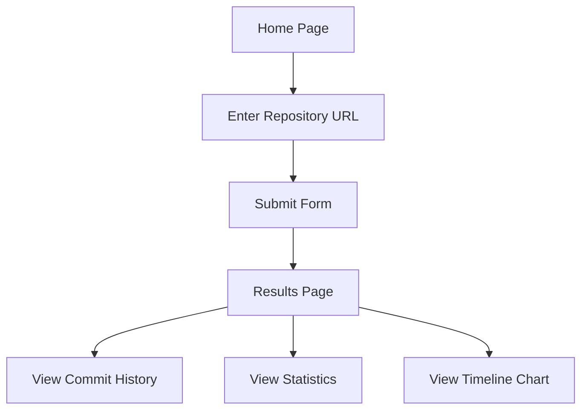

# Codebase Time Machine MVP - Product Requirements Document

## 1. Product Overview
Codebase Time Machine MVP is a simple Git repository visualization tool that provides basic insights into commit history and contributor activity. This is a minimal viable product designed to be built and deployed in 1 hour.

The application allows users to input a Git repository URL, clone it, and view basic commit statistics and timeline visualization.

## 2. Core Features

### 2.1 User Roles
| Role | Registration Method | Core Permissions |
|------|---------------------|------------------|
| User | No registration required | Can input repository URLs, view basic commit history and statistics |

### 2.2 Feature Module
Our Codebase Time Machine MVP consists of the following main pages:
1. **Home Page**: Repository URL input form, basic instructions
2. **Results Page**: Commit history display, basic statistics, simple timeline chart

### 2.3 Page Details
| Page Name | Module Name | Feature description |
|-----------|-------------|---------------------|
| Home Page | URL Input Form | Accept Git repository URL, validate format, submit for analysis |
| Home Page | Instructions | Display simple usage instructions and examples |
| Results Page | Commit List | Display recent commits with hash, message, author, and date |
| Results Page | Basic Statistics | Show total commits, contributors count, date range |
| Results Page | Simple Timeline | Basic chart showing commit frequency over time |

## 3. Core Process

**User Flow:**
1. User visits the home page
2. Enters a Git repository URL in the input form
3. Clicks "Analyze" to start the process
4. System clones the repository and parses commit history
5. User is redirected to results page showing commit list, statistics, and timeline chart
6. User can view commit details and basic repository insights

## 4. User Interface Design

### 4.1 Design Style
- **Primary Colors**: Simple blue (#007bff) for buttons and links, dark gray (#333) for text
- **Secondary Colors**: Light gray (#f8f9fa) for backgrounds, white for content areas
- **Button Style**: Simple rounded buttons with basic hover effects
- **Font**: System fonts (Arial, sans-serif) for simplicity and fast loading
- **Layout Style**: Clean, minimal design with centered content and basic spacing
- **Icons**: Simple text-based indicators, minimal use of icons

### 4.2 Page Design Overview
| Page Name | Module Name | UI Elements |
|-----------|-------------|-------------|
| Home Page | URL Input Form | Centered form with text input, submit button, basic validation messages |
| Home Page | Instructions | Simple text instructions with example repository URLs |
| Results Page | Commit List | Basic HTML table with commit data, simple pagination |
| Results Page | Statistics | Simple text display of key metrics in a basic card layout |
| Results Page | Timeline Chart | Basic HTML5 canvas chart showing commit frequency over time |

### 4.3 Responsiveness
Basic responsive design using simple CSS media queries. Mobile-friendly with stacked layout on small screens.
