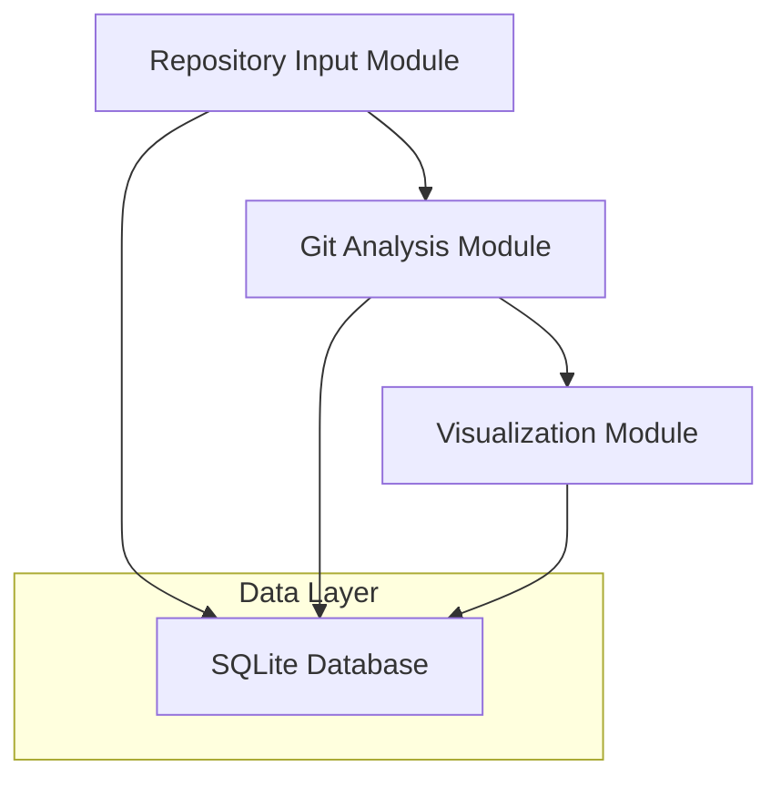

# Codebase Time Machine MVP - Module Breakdown & Implementation Guide

## 1. Module Overview

The MVP is structured into 3 core modules designed for rapid development and 1-hour implementation. This simplified approach focuses on essential functionality with minimal dependencies.



## 2. Module Specifications

### 2.1 Repository Input Module

**Purpose**: Handle repository URL input, validation, and basic cloning

**Key Responsibilities**:
- Accept Git repository URLs via web form
- Validate URL format and accessibility
- Clone repository to temporary directory
- Store repository metadata in SQLite

**Core Components**:
- Flask route handlers (`/`, `/analyze`)
- URL validation functions
- Basic Git cloning with GitPython
- SQLite database operations

**Implementation**:
```python
# app.py - Flask routes
@app.route('/')
def index():
    return render_template('index.html')

@app.route('/analyze', methods=['POST'])
def analyze_repository():
    repo_url = request.form['repo_url']
    # Validate and clone repository
    repo_id = clone_and_analyze(repo_url)
    return redirect(f'/results/{repo_id}')
```

**Implementation Time**: 15 minutes

### 2.2 Git Analysis Module

**Purpose**: Extract basic commit history and calculate simple metrics

**Key Responsibilities**:
- Parse Git commit history using GitPython
- Extract commit metadata (hash, message, author, date)
- Count files changed per commit
- Calculate basic repository statistics

**Core Components**:
- GitPython repository object
- Commit iteration and data extraction
- Basic metrics calculation
- SQLite data storage

**Implementation**:
```python
# git_analyzer.py
import git
from datetime import datetime

def analyze_repository(repo_path):
    repo = git.Repo(repo_path)
    commits = []
    
    for commit in repo.iter_commits(max_count=100):
        commits.append({
            'hash': commit.hexsha,
            'message': commit.message.strip(),
            'author': commit.author.name,
            'date': commit.committed_datetime,
            'files_changed': len(commit.stats.files)
        })
    
    return commits
```

**Implementation Time**: 20 minutes

### 2.3 Visualization Module

**Purpose**: Display commit data and basic statistics in web interface

**Key Responsibilities**:
- Render HTML templates with commit data
- Generate simple charts using Chart.js
- Display repository statistics
- Provide basic timeline visualization

**Core Components**:
- HTML templates (Jinja2)
- CSS styling for responsive design
- JavaScript for interactive charts
- JSON API endpoints for data

**Implementation**:
```html
<!-- templates/results.html -->
<div class="stats">
    <h2>Repository Statistics</h2>
    <p>Total Commits: {{ stats.total_commits }}</p>
    <p>Contributors: {{ stats.contributors }}</p>
</div>

<canvas id="commitChart"></canvas>

<script>
// Simple Chart.js implementation
const ctx = document.getElementById('commitChart');
new Chart(ctx, {
    type: 'line',
    data: {{ timeline_data | tojson }}
});
</script>
```

**Implementation Time**: 25 minutes

## 3. Implementation Guide

### 3.1 File Structure
```
codebase-time-machine/
├── app.py                 # Main Flask application
├── git_analyzer.py        # Git analysis functions
├── database.py           # SQLite operations
├── requirements.txt      # Python dependencies
├── templates/
│   ├── index.html        # Repository input form
│   └── results.html      # Analysis results display
└── static/
    ├── style.css         # Basic styling
    └── chart.js          # Chart.js library
```

### 3.2 Step-by-Step Implementation (60 minutes)

**Step 1: Setup Flask Application (10 minutes)**
```python
# app.py
from flask import Flask, render_template, request, redirect, jsonify
import sqlite3
import os
from git_analyzer import analyze_repository
from database import init_db, save_analysis

app = Flask(__name__)
app.config['SECRET_KEY'] = 'dev-key'

@app.route('/')
def index():
    return render_template('index.html')

if __name__ == '__main__':
    init_db()
    app.run(debug=True)
```

**Step 2: Create Git Analysis Module (15 minutes)**
```python
# git_analyzer.py
import git
import tempfile
import shutil
from datetime import datetime

def clone_and_analyze(repo_url):
    # Clone to temporary directory
    temp_dir = tempfile.mkdtemp()
    try:
        repo = git.Repo.clone_from(repo_url, temp_dir)
        commits = analyze_commits(repo)
        stats = calculate_stats(commits)
        return {'commits': commits, 'stats': stats}
    finally:
        shutil.rmtree(temp_dir)

def analyze_commits(repo):
    commits = []
    for commit in repo.iter_commits(max_count=100):
        commits.append({
            'hash': commit.hexsha[:8],
            'message': commit.message.strip(),
            'author': commit.author.name,
            'date': commit.committed_datetime.isoformat(),
            'files_changed': len(commit.stats.files)
        })
    return commits
```

**Step 3: Setup Database Operations (10 minutes)**
```python
# database.py
import sqlite3
import json

def init_db():
    conn = sqlite3.connect('codebase.db')
    conn.execute('''
        CREATE TABLE IF NOT EXISTS analyses (
            id INTEGER PRIMARY KEY,
            repo_url TEXT,
            analysis_data TEXT,
            created_at TIMESTAMP DEFAULT CURRENT_TIMESTAMP
        )
    ''')
    conn.commit()
    conn.close()

def save_analysis(repo_url, analysis_data):
    conn = sqlite3.connect('codebase.db')
    cursor = conn.execute(
        'INSERT INTO analyses (repo_url, analysis_data) VALUES (?, ?)',
        (repo_url, json.dumps(analysis_data))
    )
    analysis_id = cursor.lastrowid
    conn.commit()
    conn.close()
    return analysis_id
```

**Step 4: Create HTML Templates (15 minutes)**
```html
<!-- templates/index.html -->
<!DOCTYPE html>
<html>
<head>
    <title>Codebase Time Machine</title>
    <link rel="stylesheet" href="{{ url_for('static', filename='style.css') }}">
</head>
<body>
    <div class="container">
        <h1>Codebase Time Machine MVP</h1>
        <form method="POST" action="/analyze">
            <input type="url" name="repo_url" placeholder="Enter Git repository URL" required>
            <button type="submit">Analyze Repository</button>
        </form>
    </div>
</body>
</html>
```

**Step 5: Add Visualization (10 minutes)**
```html
<!-- templates/results.html -->
<div class="stats">
    <h2>{{ repo_url }}</h2>
    <p>Total Commits: {{ stats.total_commits }}</p>
    <p>Contributors: {{ stats.contributors }}</p>
</div>
<canvas id="commitChart" width="400" height="200"></canvas>
<script src="https://cdn.jsdelivr.net/npm/chart.js"></script>
<script>
const ctx = document.getElementById('commitChart');
new Chart(ctx, {
    type: 'line',
    data: {{ chart_data | tojson }}
});
</script>
```

### 3.3 Requirements File
```txt
# requirements.txt
Flask==2.3.3
GitPython==3.1.37
sqlite3
```

### 3.4 Basic CSS Styling
```css
/* static/style.css */
.container {
    max-width: 800px;
    margin: 0 auto;
    padding: 20px;
    font-family: Arial, sans-serif;
}

form {
    margin: 20px 0;
}

input[type="url"] {
    width: 70%;
    padding: 10px;
    margin-right: 10px;
}

button {
    padding: 10px 20px;
    background: #007bff;
    color: white;
    border: none;
    cursor: pointer;
}

.stats {
    background: #f8f9fa;
    padding: 20px;
    margin: 20px 0;
    border-radius: 5px;
}
```

## 4. Replit Deployment Guide

### 4.1 Setup Steps
1. Create new Replit project with Python template
2. Upload all files to the project
3. Install dependencies: `pip install -r requirements.txt`
4. Run the application: `python app.py`
5. Access via Replit's web preview

### 4.2 Replit Configuration
```python
# Update app.py for Replit
if __name__ == '__main__':
    init_db()
    app.run(host='0.0.0.0', port=5000, debug=True)
```

### 4.3 Testing the MVP
1. Enter a public GitHub repository URL
2. Click "Analyze Repository"
3. View commit statistics and timeline chart
4. Verify data is stored in SQLite database

## 5. Success Criteria
- ✅ Accept repository URLs via web form
- ✅ Clone and analyze Git repositories
- ✅ Display basic commit statistics
- ✅ Show simple timeline visualization
- ✅ Store analysis data in SQLite
- ✅ Deploy successfully to Replit
- ✅ Complete implementation in 60 minutes

## 6. Next Steps for Full Implementation

After completing the MVP, consider these enhancements:

### 6.1 Advanced Features
- **Semantic Analysis**: Add commit classification using NLP
- **Query Engine**: Natural language queries for repository insights
- **Advanced Visualizations**: Interactive graphs and heatmaps
- **Business Context**: Link commits to tickets and requirements

### 6.2 Technical Improvements
- **Database Upgrade**: Migrate from SQLite to PostgreSQL/Neo4j
- **Caching Layer**: Add Redis for performance optimization
- **Authentication**: User management and repository access control
- **API Design**: RESTful APIs for external integrations

### 6.3 Production Readiness
- **Error Handling**: Comprehensive error management
- **Logging**: Structured logging and monitoring
- **Testing**: Unit, integration, and end-to-end tests
- **Security**: Input validation and secure deployment
- **Scalability**: Handle large repositories and concurrent users
