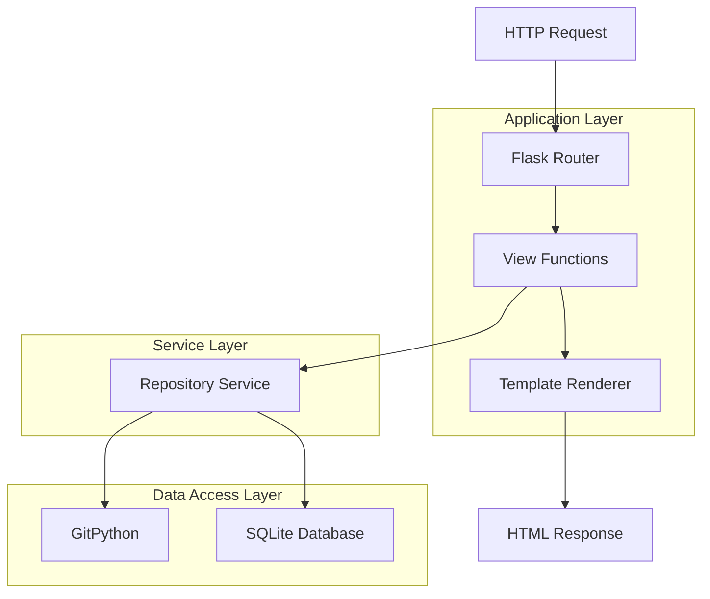
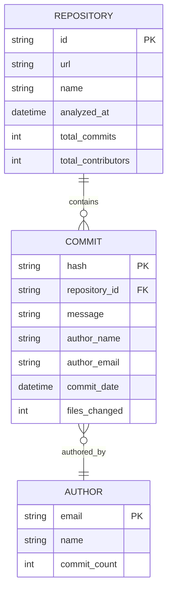

# Codebase Time Machine MVP - Technical Architecture Document

## 1. Architecture Design

```mermaid
graph TD
    A[User Browser] --> B[Flask Web Application]
    B --> C[GitPython Library]
    B --> D[SQLite Database]
    B --> E[Static Files (HTML/CSS/JS)]
    
    subgraph "Frontend Layer"
        E
    end
    
    subgraph "Backend Layer"
        B
        C
    end
    
    subgraph "Data Layer"
        D
    end
```

## 2. Technology Description

- **Backend**: Python 3.9+ + Flask + GitPython
- **Database**: SQLite (file-based, no setup required)
- **Frontend**: HTML5 + CSS3 + Vanilla JavaScript
- **Deployment**: Replit (web hosting)
- **Dependencies**: Minimal - Flask, GitPython, sqlite3 (built-in)

## 3. Route Definitions

| Route | Purpose |
|-------|----------|
| / | Home page with repository URL input form |
| /analyze | POST endpoint to process repository URL and start analysis |
| /results/<repo_id> | Results page showing commit history and statistics |
| /api/commits/<repo_id> | JSON API endpoint for commit data |
| /static/* | Static files (CSS, JS, images) |

## 4. API Definitions

### 4.1 Core API

**Repository Analysis**

```
POST /analyze
```

Request:
| Param Name | Param Type | isRequired | Description |
|------------|------------|------------|--------------|
| repo_url | string | true | Git repository URL (GitHub, GitLab, etc.) |

Response:
| Param Name | Param Type | Description |
|------------|------------|-------------|
| repo_id | string | Unique identifier for the analyzed repository |
| status | string | Analysis status (success, error) |
| message | string | Status message or error description |

Example:
```json
{
  "repo_id": "abc123",
  "status": "success",
  "message": "Repository analyzed successfully"
}
```

**Get Commit Data**

```
GET /api/commits/<repo_id>
```

Response:
| Param Name | Param Type | Description |
|------------|------------|-------------|
| commits | array | List of commit objects |
| stats | object | Repository statistics |
| timeline | array | Timeline data for chart |

Example:
```json
{
  "commits": [
    {
      "hash": "abc123",
      "message": "Initial commit",
      "author": "John Doe",
      "date": "2023-01-01T10:00:00Z",
      "files_changed": 5
    }
  ],
  "stats": {
    "total_commits": 150,
    "contributors": 5,
    "date_range": "2023-01-01 to 2023-12-01"
  },
  "timeline": [
    {"date": "2023-01", "commits": 10},
    {"date": "2023-02", "commits": 15}
  ]
}
```

## 5. Server Architecture Diagram



## 6. Data Model

### 6.1 Data Model Definition



### 6.2 Data Definition Language

**SQLite Schema**

```sql
-- Create repositories table
CREATE TABLE IF NOT EXISTS repositories (
    id TEXT PRIMARY KEY,
    url TEXT NOT NULL,
    name TEXT NOT NULL,
    analyzed_at DATETIME DEFAULT CURRENT_TIMESTAMP,
    total_commits INTEGER DEFAULT 0,
    total_contributors INTEGER DEFAULT 0
);

-- Create commits table
CREATE TABLE IF NOT EXISTS commits (
    hash TEXT PRIMARY KEY,
    repository_id TEXT NOT NULL,
    message TEXT NOT NULL,
    author_name TEXT NOT NULL,
    author_email TEXT NOT NULL,
    commit_date DATETIME NOT NULL,
    files_changed INTEGER DEFAULT 0,
    FOREIGN KEY (repository_id) REFERENCES repositories (id)
);

-- Create authors table
CREATE TABLE IF NOT EXISTS authors (
    email TEXT PRIMARY KEY,
    name TEXT NOT NULL,
    commit_count INTEGER DEFAULT 0
);

-- Create indexes for performance
CREATE INDEX IF NOT EXISTS idx_commits_repo ON commits(repository_id);
CREATE INDEX IF NOT EXISTS idx_commits_date ON commits(commit_date);
CREATE INDEX IF NOT EXISTS idx_commits_author ON commits(author_email);
```

## 7. File Structure

```
codebase-time-machine-mvp/
├── app.py                 # Main Flask application
├── requirements.txt       # Python dependencies
├── database.py           # Database operations
├── git_analyzer.py       # Git repository analysis
├── templates/            # HTML templates
│   ├── index.html       # Home page
│   └── results.html     # Results page
├── static/              # Static files
│   ├── style.css        # CSS styles
│   └── script.js        # JavaScript code
└── data/                # SQLite database storage
    └── repositories.db  # Database file
```

## 8. Deployment Configuration

### Replit Setup

**replit.nix** (Replit configuration):
```nix
{ pkgs }: {
  deps = [
    pkgs.python39Full
    pkgs.git
  ];
}
```

**requirements.txt**:
```
Flask==2.3.3
GitPython==3.1.40
```

**main.py** (Replit entry point):
```python
from app import app

if __name__ == '__main__':
    app.run(host='0.0.0.0', port=5000, debug=True)
```

### Environment Variables
```bash
# No external API keys required for MVP
# All data stored locally in SQLite
FLASK_ENV=development
FLASK_DEBUG=True
```

This simplified architecture is designed for rapid development and deployment on Replit, focusing on core functionality that can be implemented in 1 hour.